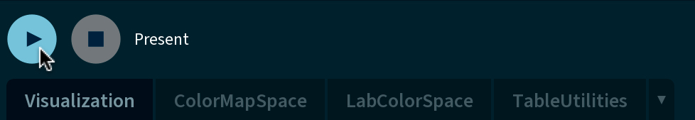

# Earthquake Data Visualization

[![Github][Github-shield]][Github-url]
[![LinkedIn][linkedin-shield]][linkedin-url]
[![Email][email-shield]][email-url]
[![Personal Website][jyzheng-shield]][jyzheng-url]

<!-- TABLE OF CONTENTS -->

  
Table of Contents

  <ol>
    <li><a href="#about-the-project">About The Project</a></li>
    <li><a href="#built-with">Built With</a></li>
    <li><a href="#getting-started">Getting Started</a></li>
    <li><a href="#license">License</a></li>
    <li><a href="#contributors">Contributors</a></li>
    <li><a href="#acknowledgments">Acknowledgments</a></li>
  </ol>

<!-- ABOUT THE PROJECT -->
## About The Project

Earthquake Data Visualization (EDV) is an interactive data visualization program developed using Java, Processing IDE and various libraries. The goal of this program is to explore global major and great earthquakes, from 1950 through 2020, in a visually engaging and informative manner. Multivariate data, such as individual earthquake information, death counts, in addition to cumulative country death counts, are represented through various mediums such as color, texture, and size. With the EDV program, users can gain valuable insight into seismic activity patterns (and its resulting effects on human population) throughout time, enabling a deeper understanding of earthquakes on a global scale.

![Product Name Screen Shot][program-screenshot]

(<a href="#readme-top">back to top</a>)

<!-- BUILT WITH -->
## Built With

The following frameworks/libraries were used to bootstrap this project:

* [![Java][Java.com]][Java-url]
* [![Python][Python.org]][Python-url]

(<a href="#readme-top">back to top</a>)

<!-- GETTING STARTED -->
## Getting Started

1. Download and install the <a href="www.processing.org/download">Processing IDE</a>
2. Clone the repo to your local computer
3. Navigate to the `VisProgram` folder and open up `Visualization.pde`
4. Click on the triangular **Run** button to start the EDV program
   >

The program should open in a new window automatically. You may now interact with the program features and explore global earthquake data.
    

(<a href="#readme-top">back to top</a>)

<!-- LICENSE -->
## License

Distributed under the MIT License. See [LICENSE][license-url] for more information.

(<a href="#readme-top">back to top</a>)

<!-- CONTRIBUTORS -->
## Contributors

<li><a href="https://github.com/mkim00216">Marybelle Kim</a></li>
<li><a href="https://github.com/pande182">Anushka Pande</a></li>

(<a href="#readme-top">back to top</a>)

<!-- ACKNOWLEDGMENTS -->
## Acknowledgments

* Helper functions from CSCI 5609 Spring 2023 assignments by [Daniel Keefe](https://www.danielkeefe.net/)
* Global map drawn using [GeoMap library](https://www.gicentre.net/geomap/using)
* Legend interface created using [ControlP5 library](https://www.sojamo.de/libraries/controlP5/)
* Deathcount line texture created using [Handy library](https://www.gicentre.net/handy)
* Global earthquake data collected from [Significant Earthquakes Database](https://public.opendatasoft.com/explore/dataset/significant-earthquake-database/table/?dataChart=eyJxdWVyaWVzIjpbeyJjb25maWciOnsiZGF0YXNldCI6InNpZ25pZmljYW50LWVhcnRocXVha2UtZGF0YWJhc2UiLCJvcHRpb25zIjp7fX0sImNoYXJ0cyI6W3siYWxpZ25Nb250aCI6dHJ1ZSwidHlwZSI6ImNvbHVtbiIsImZ1bmMiOiJBVkciLCJ5QXhpcyI6InllYXIiLCJzY2llbnRpZmljRGlzcGxheSI6dHJ1ZSwiY29sb3IiOiIjRkY1MTVBIn1dLCJ4QXhpcyI6ImNvdW50cnkiLCJtYXhwb2ludHMiOjUwLCJzb3J0IjoiIn1dLCJ0aW1lc2NhbGUiOiIiLCJkaXNwbGF5TGVnZW5kIjp0cnVlLCJhbGlnbk1vbnRoIjp0cnVlfQ%3D%3Dhttps:%2F%2Fpublic.opendatasoft.com%2Fapi%2Fexplore%2Fv2.1%2Fcatalog%2Fdatasets%2Fsignificant-earthquake-database%2Fexports%2Fxlsx%3Flang%3Den&timezone=America%2FChicago&use_labels=true&location=6,42.97812,-71.53946&basemap=jawg.light)
* [README template](https://github.com/othneildrew/Best-README-Template/blob/master/BLANK_README.md) inspiration from [othneildrew](https://github.com/othneildrew)

(<a href="#readme-top">back to top</a>)

<!-- MARKDOWN LINKS & IMAGES -->
[license-url]: ./LICENSE
[linkedin-shield]: https://img.shields.io/badge/LinkedIn-0077B5?style=for-the-badge&logo=linkedin&logoColor=white
[linkedin-url]: https://linkedin.com/in/jzheng129
[program-screenshot]: ./images/program.png
[jyzheng-shield]: https://img.shields.io/badge/website-4870db?style=for-the-badge&logo=About.me&logoColor=ffffff
[jyzheng-url]: https://www.jyzheng.com
[Github-shield]: https://img.shields.io/badge/GitHub-100000?style=for-the-badge&logo=github&logoColor=white
[Github-url]: https://github.com/jzheng613
[email-shield]: https://img.shields.io/badge/Gmail-D14836?style=for-the-badge&logo=gmail&logoColor=white
[email-url]: jessica@jyzheng.com

[Java.com]: https://img.shields.io/badge/java-%23ED8B00.svg?style=for-the-badge&logo=openjdk&logoColor=white
[Java-url]: https://www.oracle.com/java
[Python.org]: https://img.shields.io/badge/python-3670A0?style=for-the-badge&logo=python&logoColor=ffdd54
[Python-url]: https://www.python.org